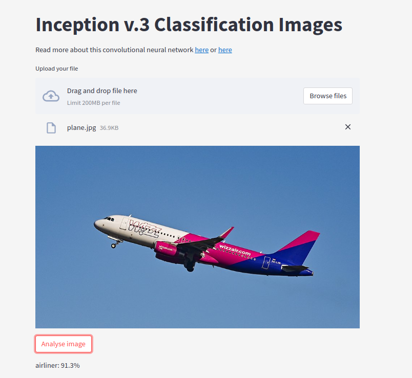
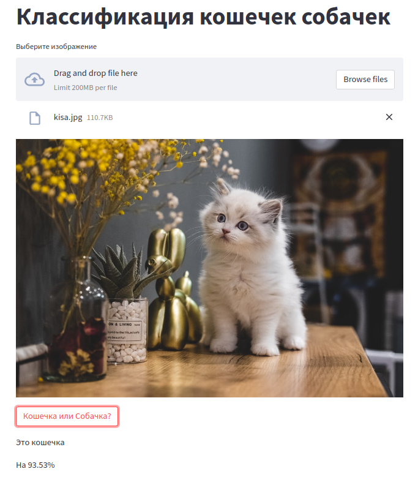
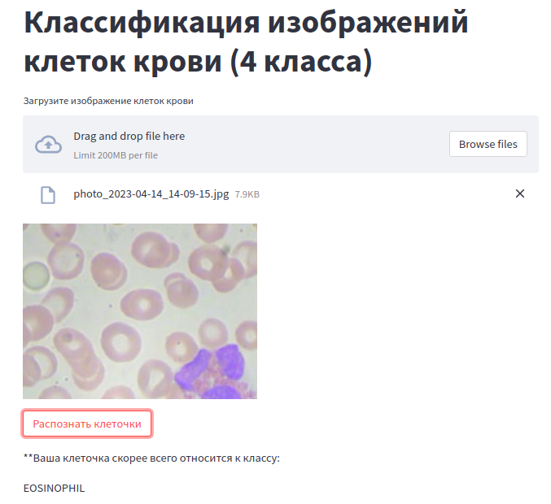
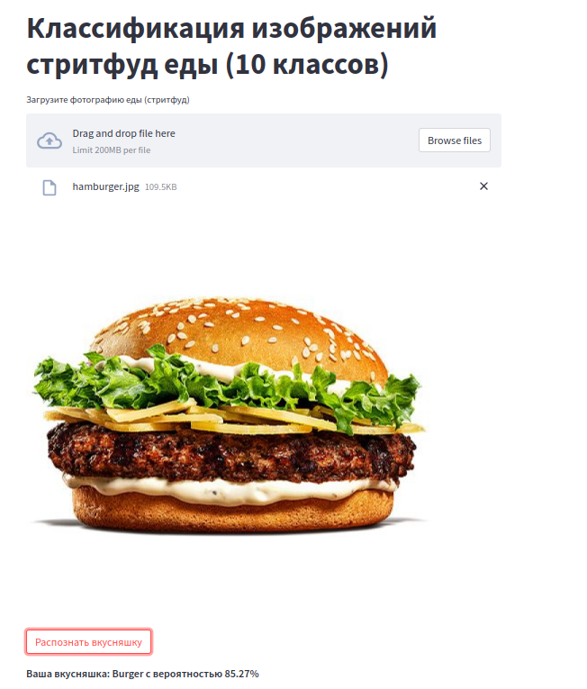

# :framed_picture: nn_project
[Image Classification multi-page streamlit app](https://galkamt-nn-project-streamlit-app-m9zubm.streamlit.app/) 

- Классификация произвольного изображения с помощью модели Inception (обученной на датасете ImageNet. Использована готовая модель из torchvision.models) 
- Классификация изображений котов и собак дообученной моделью ResNet18 (Предобученную часть из torchvision.models с заменой последнего слоя.Все параметры кроме классификационного слоя заморожены) 
- Классификация клеток крови (4 типа) дообученной моделью ResNet50 (Предобученную часть из torchvision.models с заменой последнего слоя.Все параметры кроме классификационного слоя заморожены) 
- Классификация фастфуда (10 категорий) дообученной моделью DenseNet201 (Предобученную часть из torchvision.models с заменой последнего слоя.Все параметры кроме классификационного слоя заморожены)  

Примеры работы приложения:  
   
   

### Linear team: 
[IvaElen](https://github.com/IvaElen) - отвечала за классификацию клеток крови 
[GalkaMT](https://github.com/GalkaMT) -отвечала за классификацию произвольных изображений, деплой приложения, оформление репозитория 
[AlexeyPratsevityi](https://github.com/AlexeyPratsevityi) - отвечал за классификацию стритфуда и кошечек с собачками 

**Стэк:** Streamlit, PyTorch, Pillow
